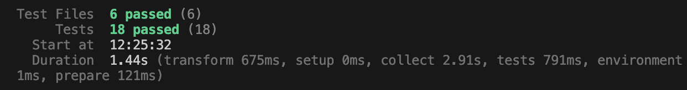
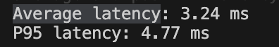
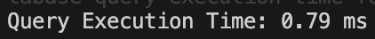
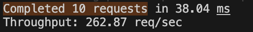
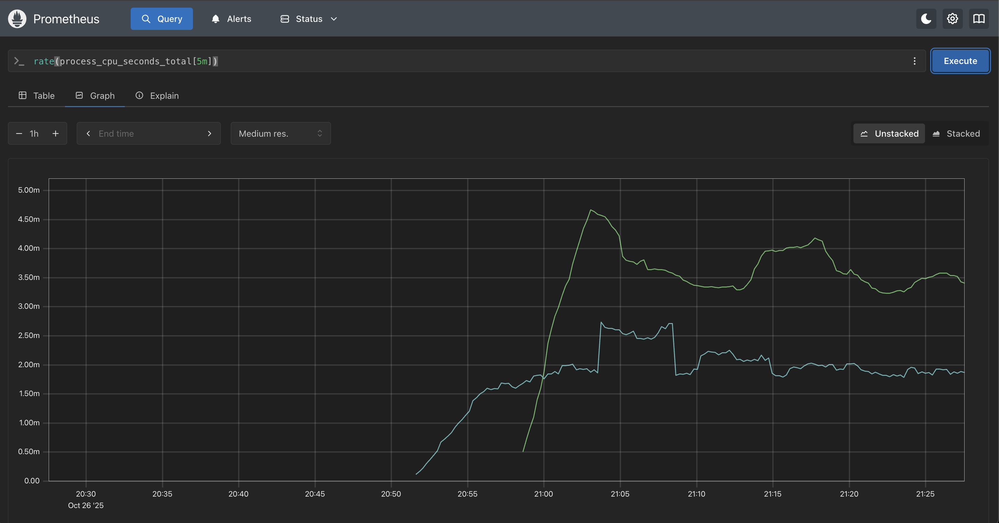
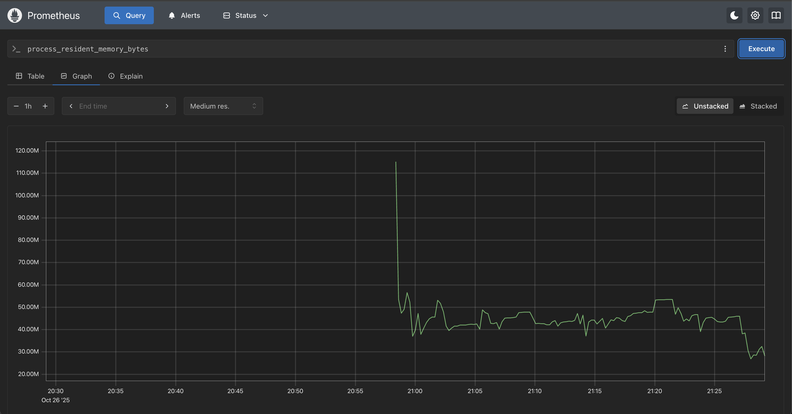
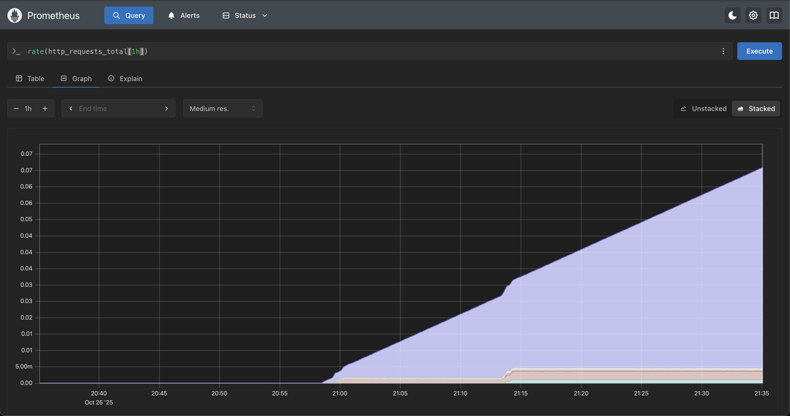
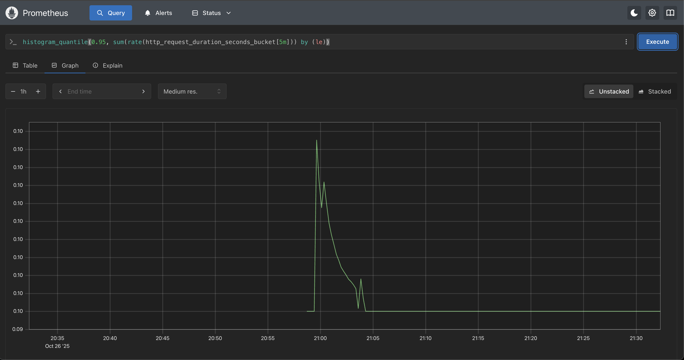

# Fullstack Interview Project (Node + React)

A simple **Node.js + React (Next.js)** fullstack application demonstrating backend API design, frontend integration, testing, and modular architecture.

## Table of contents
* [General info](#general-info)
* [Technologies](#technologies)
* [Setup](#setup)
* [App Endpoints](#app-endpoints)
* [API Documentation](#api-documentation)
* [Testing](#testing)
* [Monitoring Metrics](#monitoring-metrics)
* [Design Decisions](#design-decisions)
* [Trade-offs and Next Steps](#trade-offs-and-next-steps)

## General info
This project consists of:
- A **Node.js (Express)** backend API with database persistence, validation, and testing.
- A **React (Next.js)** frontend application consuming the API.
- A focus on clean architecture, type safety, and maintainability.

It was developed as part of a **fullstack engineering assessment** to demonstrate architectural design, testing, and end-to-end integration between frontend and backend.

## Technologies

### Backend (API)
* Node.js (Express)
* TypeScript
* Prisma ORM + PostgreSQL/Sqlite
* Zod (validation)
* Vitest + Supertest (testing)
* Swagger / OpenAPI
* Docker

### Frontend (Web)
* React (Next.js 14)
* TypeScript
* Tailwind CSS
* Axios / React Query
* Vitest + React Testing Library


## Setup

### Installation on Linux and Mac OS
* [Follow this guide](https://help.github.com/articles/fork-a-repo) to clone or fork the repository.
* [Install Docker](https://docs.docker.com/engine/install/) if you prefer containerized setup.
* Create an `.env` file using the provided `.env.example` template and set environment variables:


---


## App Endpoints

**Base URL:** `http://localhost:4000/api`

| Endpoint | Method | Description |
|-----------|---------|-------------|
| `/api/movies` | GET | Returns all movies |
| `/api/movies/:id` | GET | Returns a single movie |
| `/api/movies` | POST | Creates a new movie |
| `/api/movies/:id` | PATCH | Updates movie details |
| `/api/movies/:id` | DELETE | Deletes a movie |
| `/api/health/live` | GET | Health check endpoint |
| `/api/health/ready` | GET | Health readiness endnpoint |

**Frontend Pages**
| Path | Description |
|------|--------------|
| `/` | Movie listing page |
| `/movies/[id]` | Movie detail page |
| `/admin` | Add new movie page |

---

## API Documentation
Once the backend server is running:
- `/docs` - Swagger UI doc

## Testing
### 🧭 Running the Tests

```bash
# Run all tests (unit, integration, and performance)
npm run test
```


### 🧭 Metrics Tracked

| Metric | Description | Threshold |
|--------|--------------|------------|
| **Average API Latency** | Measures mean response time for `GET /movies` over 20 runs. | `< 300 ms` |
| **P95 Latency** | Ensures tail-end requests stay performant. | `< 500 ms` |
| **Database Query Time** | Evaluates Prisma query performance for year-range filters. | `< 100 ms` |
| **Throughput (RPS)** | Measures total requests handled per second (10 concurrent requests). | `> 5 req/sec` |
| **Payload Size** | Ensures JSON response remains optimized for network transfer. | `< 50 KB` |
| **Data Consistency** | Verifies identical response structure across repeated runs. | ✅ Consistent |

---
### Screenshots






## Monitoring Metrics
Sample monitoring metrics from prometheus (local test)

### 🧠 1. CPU Usage
- Shows how much CPU time the app consumes.


### 💾 2. Memory Usage
- Tracks app’s current RAM consumption.


### 🌐 3. HTTP Request Rate
- Number of incoming HTTP requests per second.


### ⚡ 4. Request Latency (95th Percentile)
- Shows response time at the 95th percentile (user experience metric).



## ⚙️ Design Decisions
- **Import Structure:** Configured **absolute imports** instead of relative imports for cleaner module references.

### 🧠 Backend Decisions

- **Database:** Using transactional context and fixtures for testing.
- **Teardown Management:** Implemented context manager for teardown operations during tests.
- **Schema Enhancement:** Added a `thumbnail` attribute to the movie schema for better UI/UX visualization.
- **Filter Consistency:** Splitted the `year` filter into `minYear` and `maxYear` to support filtering within a year range and maintain consistency.
- **Service-Oriented Backend** Each domain feature (e.g., movies) has separate routes, controllers, and services for clean separation of concerns.

---

### 💻 Frontend Decisions

- **Data Handling & State Management:**  
  - Fetching movie details directly from the backend on the detail page.  
  - - Responses are cached using to minimize redundant network requests and improve perceived performance.  
  - - Cached data has a short TTL to balance speed and freshness.
  - Application state is managed locally where appropriate, while shared/global state is minimal to reduce complexity.

- **Data Fetching Strategy:**  
  - Using **`useQuery`** for GET requests (with automatic caching).  
  - For non-GET operations (POST, PUT, DELETE, etc.), use direct mutation handlers or similar utilities.

- **Component & UI Library:**  
  - Built UI using **[shadcn/ui](https://shadcn.dev/)** for consistent, prebuilt components.  
  - Icons implemented via **[lucide-react](https://lucide.dev/)** for lightweight, scalable SVG icons.


## Trade-offs and Next Steps

The following improvements and features are planned to enhance the Movie App, improve scalability, security, and maintainability, and align with industry best practices:

### 1. **Backend Enhancements**
- **Caching Layer:**  
  - Implement server-side caching (e.g., Redis) to reduce repeated database queries for frequently accessed endpoints.  
  - Introduce query-level caching and cache invalidation for list and detail endpoints.
- **Role-Based Access Control (RBAC):**  
  - Add **User models** with roles such as `admin`, `editor`, and `viewer`.  
  - Restrict certain endpoints and mutations based on roles to improve security and multi-tenant support.
- **Authentication & Authorization:**  
  - Implement **JWT authentication** for stateless API security.  
  - Integrate **OAuth2 / OpenID Connect** for single sign-on (SSO) with popular providers (Google, GitHub, Microsoft).  
  - Refresh token mechanism for improved session management.
- **Advanced Query Features:**  
  - Consider polyglot persistence to handle read & write heavy features respectively.  
  - Implement **db indexing** for faster reads.

### 2. **Frontend Enhancements**
- **Optimized Data Fetching & Management:**  
  - Implement Redux for predictable global state management, ensuring consistent data flow across pages and components.
- **User Roles & Permissions:**  
  - Hide or restrict UI components based on user roles.  
  - Admin dashboard for managing movies, users, and analytics.
- **UI/UX Improvements:**  
  - Add more precise **skeleton loaders** and transition animations for smoother experience.  
  - Implement full responsive design for tablet and mobile devices.


### Follow-up Priorities
- Add **CI/CD pipeline** with GitHub Actions for automated testing and deployment.
- Implement **authentication and authorization**.
- Integrate **Redis caching** for improved API performance.
- Add **E2E tests** using Playwright or Cypress.


## Author
**Emmanuel Owusu**  
Software Engineer | Fullstack & DevOps  
📧 [emmowu10@gmail.com](mailto:emmowu10@gmail.com)  
💼 [LinkedIn](https://linkedin.com/in/owusuemmanuel) | [GitHub](https://github.com/coding-rev)


